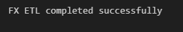
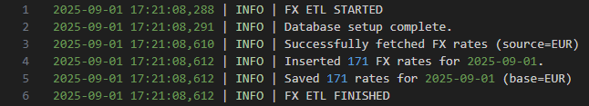
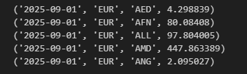
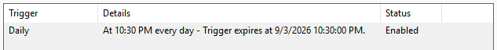
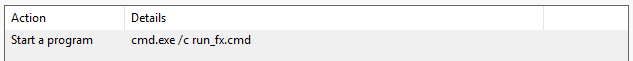
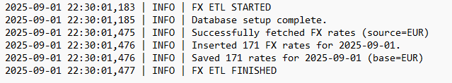

# FX ETL Pipeline

Automated ETL (Extract, Transform, Load) pipeline for daily EUR-based foreign exchange (FX) rates.
It retrieves data from the [exchangerate.host](https://exchangerate.host/) API, stores the results in a SQLite database, logs all executions, and supports scheduling via Windows Task Scheduler.

---

## Features

- Fetches daily foreign exchange (FX) rates with EUR as base currency
- Stores results in a local SQLite database (`fx.db`)
- Logs all executions, including successful runs and errors, to `fx.log`
- Provides automated tests with `pytest` for reliability
- Supports automation via `run_fx.cmd` and Windows Task Scheduler

---

## Project Structure
```
fx-etl/
├── fx.py              # ETL script
├── tests/             # Automated tests
│   └── test_fx.py
├── run_fx.cmd         # Windows Task Scheduler wrapper
├── requirements.txt   # Dependencies
├── images/            # Screenshots
└── README.md
```

**Note:** `fx.db` and `fx.log` are generated automatically when running the pipeline and are excluded from version control.

---

## Installation

1. **Create and activate a virtual environment**
   ```bash
   python -m venv .venv
   # Windows
   .venv\Scripts\activate
   # macOS/Linux
   source .venv/bin/activate

2. **Install dependencies**
   pip install -r requirements.txt

3. **Add your API key to a `.env` file**
   FX_API_KEY=your_api_key_here

---

## Usage

1. **Run the ETL pipeline manually**

    ```bash
    python fx.py
    ```

2. **Verify the output**

    The script will print a success message in the terminal and write logs to `fx.log`.

    Example terminal output:

    

---

## Logs

Execution details are written to `fx.log`.

Example log output:



---

## Database

The pipeline stores all FX rates in a local SQLite database (`fx.db`).
Each row contains the date, base currency, target currency, and exchange rate.

Example rows from the `fx_rates` table:



---

## Tests

Automated tests are written with `pytest`.
Run them with:

```bash
python -m pytest -q
```

Example result:


---

## Scheduling (Windows)

The pipeline can be automated using **Windows Task Scheduler**.

Use the included `run_fx.cmd` script as the scheduled action.

Steps:
1. Open *Task Scheduler*
2. Create a new task
3. Action: Program = `cmd.exe`, Arguments = `/c run_fx.cmd`
4. Set a trigger, for example once per day at 22:30
5. Verify successful execution in `fx.log`

<br>

Example configuration:





Log results:



---

## Technologies & Tools
- **Python**: logging, sqlite3, requests, dotenv, pathlib
- **Testing**: pytest
- **Automation**: Windows Task Scheduler

